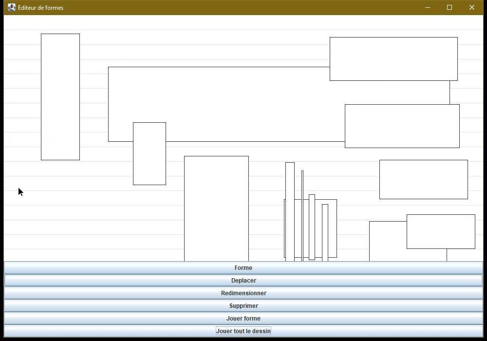

# Lecteur de formes

Projet support SLAM5.

## Démonstration du projet fini (sans le son, mais c'est la sixième de Beethov comme on peut le voir facilement)

## Travail à faire

Le projet *commité* ici ne compile pas et il manque des fonctionnalités.

1. Complétez l'implémentation du constructeur de la classe `LecteurDeDessin`.
2. Complétez l'implémentation de la méthode `selectionnerEtJouerLesFormes` de la classe `LecteurDeDessin`.
3. Ajoutez la surcharge constructeur manquante dans la classe `Forme`.
4. Complétez l'implémentation des trois méthodes `contientX`, `contientY` et `contient` de la classe `Forme`.
5. Complétez l'implémentation des trois méthodes `contientLaForme`, `ajouterForme` et `supprimerForme` de la classe `Dessin`.
6. Complétez l'implémentation des deux méthodes `getPremiereFormeEn` et `formesSurLaColonne` de la classe `Dessin`.
7. Compléter l'implémentation de la méthode `pressDansZoneDessin` de la classe `OutilDeplacer`.
8. Compléter l'implémentation des deux méthodes `ajouterAuDessin` et `supprimerDuDessin` de la classe `EditeurDeFormes`.
9. Ajoutez tous les getters et setters nécessaires à la compilation et au bon fonctionnement de l'application.
